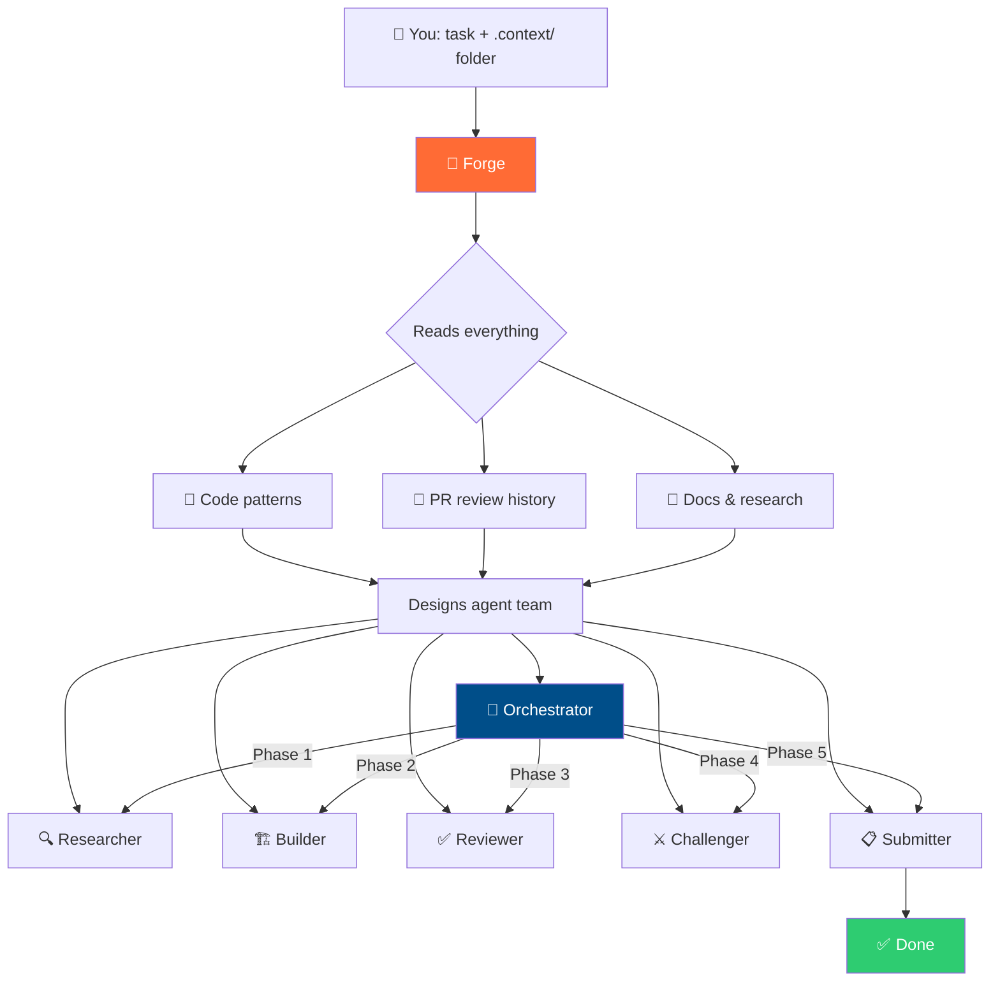
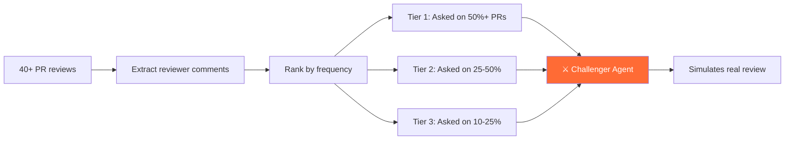
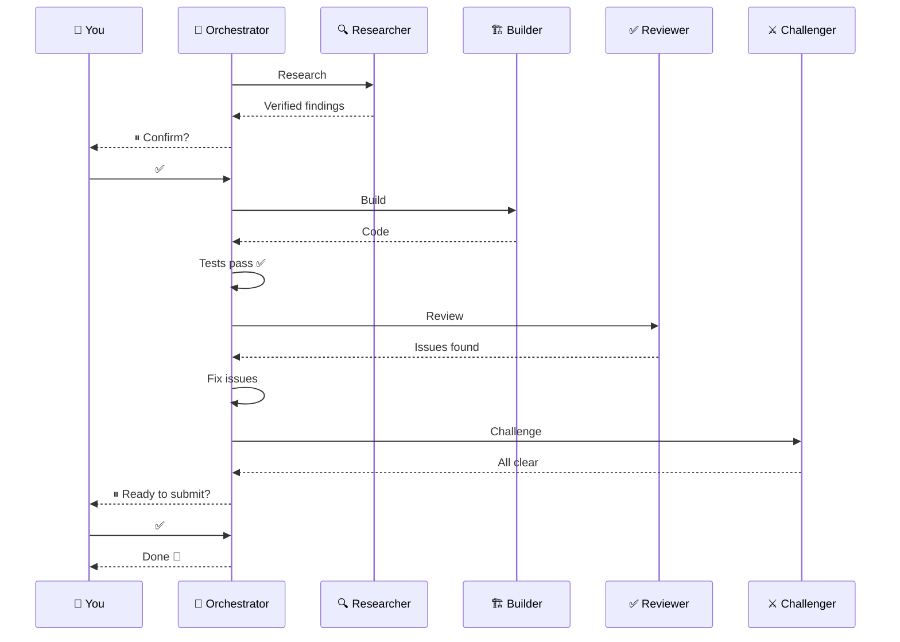

# Claude Forge

One agent that builds an army.

Point it at any project with a task. It analyzes the codebase, studies PR review patterns, and creates a team of specialized Claude Code agents orchestrated to complete the work — with built-in quality checks and human approval gates.

```
You + Task + Context → Forge → Specialized Agent Team → Orchestrated Execution → Result
```

## How It Works



## Quick Start

### 1. Install

Copy the forge agent to your Claude Code agents directory:

```bash
cp forge.md ~/.claude/agents/
```

### 2. Prepare Context

Create a `.context/` folder in your project with any relevant information:

```
your-project/
├── .context/
│   ├── task.md              # What you want to accomplish
│   ├── research/            # Any docs, specs, references
│   └── examples/            # Examples of what good output looks like
└── (your project files)
```

### 3. Run

In Claude Code, invoke the forge:

```
@forge Analyze this project and build agents for: [your task]
```

The forge reads your project and `.context/`, then creates a complete team of agents in `~/.claude/agents/` with an orchestrator that chains them together.

### 4. Execute

Run the orchestrator the forge created:

```
@[project]-orchestrator Go
```

The orchestrator runs each agent in sequence with human checkpoints at critical decisions.

## What the Forge Creates

Every agent team is different — tailored to the project and task. But they follow proven archetypes:

| Agent | Role | Tools |
|-------|------|-------|
| **Researcher** | Gathers and verifies information needed for the task | Read, Grep, WebSearch, WebFetch |
| **Builder** | Creates code/content following the project's exact patterns | Read, Write, Edit, Grep, Bash |
| **Reviewer** | Checks output against project standards (linting, tests, conventions) | Read, Grep, Bash |
| **Challenger** | Simulates the lead reviewer's style from real PR data | Read, Grep, WebSearch, WebFetch |
| **Submitter** | Creates polished PRs/deliverables matching the team's format | Read, Grep, Bash |
| **Orchestrator** | Chains all agents with dependencies and human checkpoints | All tools + Agent |

## What Makes This Different

### Reviewer Modeling

The forge doesn't just check code against linting rules. It reads the project's actual PR review history, extracts the lead reviewer's comments, ranks them by frequency, and builds a challenger agent that asks the same questions they would.



### Self-Verifying Research

Research agents don't just find information — they prove it. When researching algorithms, they compute step-by-step proofs. When citing sources, they fetch every URL to verify it's accessible. When claiming facts, they cross-reference from 2+ independent sources.

```
Finding: "Tax ID uses modulo-11 checksum with weights [8,7,6,5,4,3,2]"

Proof:
  ID: 00177041
  Products: 0×8=0, 0×7=0, 1×6=6, 7×5=35, 7×4=28, 0×3=0, 4×2=8
  Sum: 77
  11 - (77 % 11) = 11 → edge case → check digit = 1 ✓

Status: ✅ Verified against 5 real company IDs
```

### Context-Driven Design

Feed different context, get different agent teams. The forge reads everything in `.context/` and designs agents grounded in the actual project — not generic prompts.

### Orchestrated Pipeline

Agents don't run independently. The orchestrator chains them with dependencies and human approval gates:



## Agent Design Principles

The forge follows these principles when creating agents:

1. **Ground in reality** — every code template comes from the actual project, not generic patterns
2. **Quote the reviewer** — challenger agents use verbatim quotes, not paraphrases
3. **Verify, don't trust** — research agents prove their own findings before outputting
4. **Minimum tools** — each agent gets only the tools it needs (read-only agents can't write)
5. **Human checkpoints** — the orchestrator pauses for approval at critical decisions
6. **Anti-patterns matter** — telling agents what NOT to do prevents the most common mistakes
7. **Test and iterate** — the first version of every agent is wrong; test on real work and improve

## Project Structure

```
claude-forge/
├── forge.md                   # The forge agent — install this one file
├── templates/                 # Agent archetypes the forge builds from
│   ├── researcher.md
│   ├── builder.md
│   ├── reviewer.md
│   ├── challenger.md
│   ├── submitter.md
│   └── orchestrator.md
├── docs/
│   ├── context-guide.md       # How to structure .context/ folders
│   ├── methodology.md         # The thinking behind the approach
│   └── customization.md       # How to modify generated agents
└── README.md
```

## Requirements

- [Claude Code](https://claude.ai/code) CLI
- GitHub CLI (`gh`) for PR analysis and submission
- A project you want to contribute to or work on

## License

MIT
